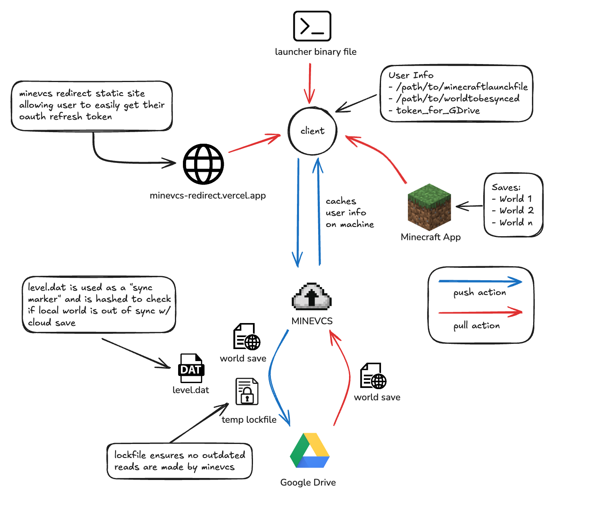

# Automatic Cloud Saving For Minecraft Java Edition

## About

MineVCS brings the functionality of automatic cloud saving to your Minecraft Java Edition world. Using Google Drive, MineVCS automatically pushes/pulls your designated world to your local machine, mirroring the effects of automatic cloud saving.

## Installation

**MacOS**: Instructions coming soon...

**Windows**: Not yet supported

## How It Works (High Level)

MineVCS syncs your Minecraft Java world folder to your personal Google Drive. When Minecraft launches, MineVCS pulls your latest save. When you exit the game, MineVCS uploads to your Drive — keeping everything in sync across devices.

## How It Works (Detailed)

A first-time user will be forced to connect to a chosen Google Drive account, requiring them to go through a custom redirect site (`minevcs-redirect.vercel.app`) to streamline the OAuth process. Once the user is authenticated, they can configure their application by selecting the path to their Minecraft launcher and the world directory they wish to sync. Once these settings are saved, a `config` file is created in a hidden directory in the user's home folder, allowing the application to persist settings across launches.

Upon detecting the Minecraft launcher starting, MineVCS pulls the latest version of the specified world from Google Drive, ensuring the local version is up to date.

When the user exits Minecraft, MineVCS first uploads a temporary `lockfile` so that any subsequent reads on a user's second machine know that an upload is in progress and don't pull. After that, MineVCS zips and uploads the updated world folder to Google Drive.

## Assumptions / Limitations

- MineVCS is designed to work with Minecraft Java Edition and requires a Google Drive account for cloud storage. It assumes that the user has enough storage space on their Google Drive to accommodate their world folder.
- MineVCS currently cannot distinguish between two `.zip` files with the same name in Google Drive. If a user has two worlds with the same name, MineVCS could mix them up. Hashing of world folders will be added in the future to prevent this.
- MineVCS is currently only available for **MacOS** as of 04/26/2025 but Windows support is coming soon! (Since syncing is via Google Drive, there won't be any slowdowns between MacOS and Windows 😁)
- MineVCS creates a hidden `.minevcs` directory in the user's home folder to store the `config` file and helper files. Users should avoid manually modifying this directory unless they know what they are doing.

## Privacy

MineVCS does not collect any personal data. It only accesses your Google Drive to sync the selected Minecraft world folder. It does not touch any files outside the selected folder and stores no data on external servers.